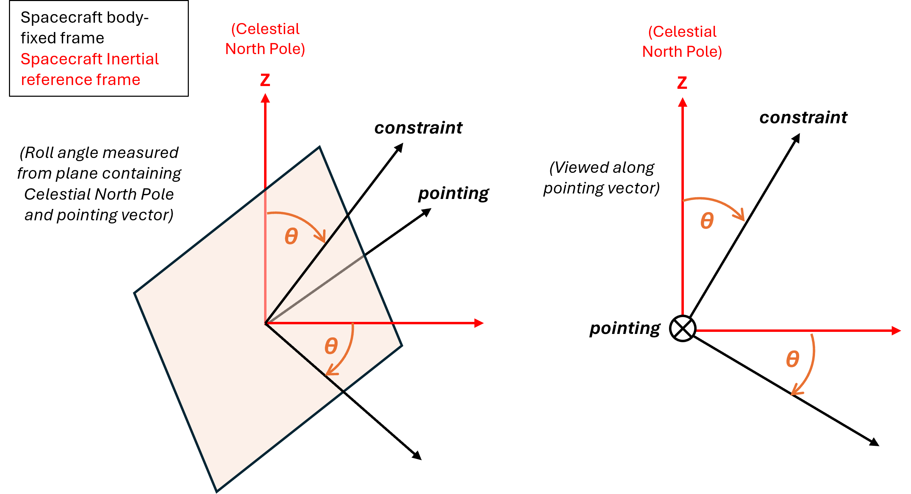

Guide
=====

.. _installation:

Installation
------------

The latest version is available on `PyPi`_.
Ensure that pip is installed and run the following command:

.. code-block:: console

   pip install spacevlbi
   
Installing with pip will install/update all of the required libraries 
automatically (`numpy`_, `poliastro`_, `matplotlib`_, `astropy`_).

.. _numpy: http://www.numpy.org/
.. _poliastro: https://www.poliastro.space/
.. _matplotlib: http://www.matplotlib.org/
.. _astropy: http://www.astropy.org/
.. _PyPi: https://pypi.org/project/spacevlbi/

.. _introduction:

Introduction
------------

**spacevlbi** relies on creation of a number of key class objects and execution
of the ``TimeLoop()`` function to conduct a simulation of a space VLBI mission.

The ``SpaceTelescope`` class enables an Earth-orbiting space telescope to be 
modelled, including a range of its main components that can affect when
observations can take place (see the :ref:`spacetelescope` and :ref:`constraints`
sections below).

The ``GroundTelescope`` class enables a ground-based radio antenna to be
modelled so that ground-space VLBI baselines can be calculated (see the 
:ref:`groundtelescope` section below for more information).

The ``GroundStation`` class enables a ground-based station for space telescope
Telemetry, Tracking and Command (TT&C) to be modelled. This is useful for
calculating the impact of a number of functional constraints (see the 
:ref:`groundstation` and :ref:`constraints` sections below).

To model a purely space-based VLBI mission, two or more ``SpaceTelescope``
objects must be created. To model a ground-space VLBI mission, two or more
``SpaceTelescope`` and ``GroundTelescope`` objects must be created. 
``GroundStation`` objects are not mandatory in order to run a simulation but
are required for inclusion of some of the functional constraints.

Once the desired VLBI array has been defined by creating objects of the classes
described above, the ``TimeLoop()`` function is executed to run the 
simulation over a defined time period and with a specific step size. At each
time step, the ``TimeLoop()`` function:

    1. Propagates space telescope(s) orbit
    2. Propagates space telescope(s) attitude
    3. Calculates Moon and Sun positions
    4. Calculates range and elevation from ground station(s) to space telescopes(s) (if ground stations are modelled)
    5. Calculates whether any functional constraints are prohibiting observations
    6. Calculates the baselines and subsequent (u,v) coverage generated by the array of a specific source (or for a range of sources across the celestial sphere if the ``allsky`` parameter is set to 1 in the execution of ``TimeLoop()``)
    
Once the ``TimeLoop()`` function has finished executing, the results of the
simulation are returned within the ``SpaceTelescope``, ``GroundTelescope`` and
``GroundStation`` objects. A number of figure types are then available to the 
user to plot key results:

    * ``OrbitPlot()`` - Plot of the space telescope orbits about the Earth
    * ``UvPlot()`` - Plot of the (u,v) coverage achieved by the array, including the impact of any functional constraints modelled
    * ``AttitudeSphere()`` - Plot of a specified space telescope's attitude sphere in the body-fixed frame including Sun, Earth and Moon positions throughout the simulation and the positions of any spacecraft components that have been modelled
    * ``SolarPanelIncidence()`` - Plot of the angle between the Sun and the spacecraft's panel normal vectors throughout the simulation
    * ``GroundStationElevation()`` - Plot of the elevation angle from each ground station to a specified space telescope throughout the simulation

Provided in the Examples folder is the script ``ExampleSetup.py``. This script 
shows how the package can be used to model a VLBI array with a single space 
element. This example is based upon the preliminary concept for the 
`BHEX`_ mission. The script ``ExampleSpaceTelescope.py`` shows how an object 
of the ``SpaceTelescope`` class can be defined.

.. _BHEX: https://www.blackholeexplorer.org/

.. _spacetelescope:
Space Telescope
---------------

A ``SpaceTelescope`` is created by defining a range of mass and configuration
properties. The spacecraft orbit is defined using classical Keplerian elements 
and an initial true anomaly at the start of the simulation. The attitude state 
of the spacecraft throughout the simulation must also be provided in terms of 
a roll angle (see :ref:`attitudeprop` section below). As well as these 
properties, the user can attach a number of component objects to a space 
telescope to model the key equipment onboard that can impact when observations 
can be performed by the system.

.. _radiopayload:
Radio Payload
~~~~~~~~~~~~~

Properties of the space telescope related to the radio observations are defined 
as part of a ``RadioPayload`` object. The radio payload includes definition of 
the antenna diameter, boresight and properties of the payload receiver 
electronics required to calculate the System Equivalent Flux Density (SEFD) of 
the telescope. Sun, Earth and Moon exclusion angles can also be included to 
model the functional constraint on observations imposed by thermal distortion 
of the science antenna due to heat input from these celestial bodies.

The exclusion angles work as follows: at any time step during the simulation, 
if the angle between the antenna boresight (its pointing direction) and the 
Sun / Earth / Moon is less than the defined exclusion angle, an observation 
cannot take place.

Multiple radio payloads can be modelled and attached to the spacecraft.
However, simulation of observations at only one frequency are currently
permitted per simulation run.

.. _startracker:
Star Tracker
~~~~~~~~~~~~

Star trackers are implemented onboard spacecraft that require high attitude 
control accuracy for their mission. Astronomy missions such as space-based 
VLBI are an example of such missions requiring very high attitude knowledge 
accuracy which can only be provided by star trackers.

A star tracker is a sensitive camera that captures images of the celestial 
sphere. It identifies the stars in the image and compares them 
to an internal star catalogue and finally estimates the attitude state of the 
spacecraft by analysing the rotation of the star field in its Field-Of-View 
(FOV). Star trackers typically have a limitation on the angle between their 
boresight and the Sun / Earth and sometimes Moon limbs. Sun, Earth and Moon 
exclusion angles can therefore be modelled to include this effect. When an 
exclusion angle is violated, it is assumed that the specific star tracker will 
not be providing useful attitude information and the star tracker is considered 
to be in a *blinded* state.

The user can attach any number of star trackers to a space telescope by 
creating a ``StarTracker`` object. As part of the ``SpaceTelescope`` object, 
the user must also define the number of star trackers required to provide 
sufficient attitude control accuracy in order to perform an observation, using 
the ``reqStarTrackers`` parameter.

The star tracker functional constraint works as follows: if at the current 
timestep the number of unblinded star trackers is less than the 
``reqStarTrackers`` parameter, an observation cannot take place.

.. _radiator:
Radiator
~~~~~~~~

Radiators are required onboard spacecraft that must provide a low temperature 
thermal environment to specific pieces of equipment. They are often used in 
conjunction with cyrogenic cooling systems for astronomy missions to provide a 
low noise environment for the detection of weak astronomical signals.

The user can define any number of ``Radiator`` objects and attach them to a 
space telescope. Radiators must typically be pointed towards deep space to 
achieve the low temperatures required by missions such as space VLBI. As such, 
the user can define Sun, Earth and Moon exclusion angles for each radiator to 
model the implementation of a baffle or shade on the radiator to reduce the 
angle at which energy from the Sun / Earth / Moon falls upon its surface.

The radiator functional constraint works as follows: if at the current timestep 
the Sun / Earth / Moon exclusion angles for any of the modelled radiators are 
violated, an observation cannot take place. In reality, it may be permissible 
for some radiators to have the Sun / Earth / Moon within their FOV for a small 
period of time. However, such time dependence on the functional constraint 
is not currently modelled in the tool.

The ``Radiator`` object can also be used to model more general thermal 
constraints on the spacecraft. For example, if there is a particular 
component or direction which cannot be pointed towards the Sun / Earth / Moon.

.. _solarpanel:
Solar Panel
~~~~~~~~~~~

Solar panels are utilised for almost all near-Earth operating spacecraft as a 
primary source of power generation. The power generated by a solar panel is 
directly proportional to the cosine of the angle between the panel normal 
vector and the incident solar radiation. The user can model any number of 
solar panels onboard the spacecraft by defining a ``SolarPanel`` object.

There is currently no functional constraint attached to the ``SolarPanel`` 
object within the tool. They can simply be used to conduct an initial 
investigation into the likely power generation capabilities of the system 
during observations by understanding how the solar incidence angle on the 
panel varies. In the future, the tool could be upgraded to enable more complete
calculation of power generation and the implementation of a functional 
constraint defining the minimum power required to perform an observation.
Batteries are also not currently modelled within the tool.

.. _commssystem:
Communication System
~~~~~~~~~~~~~~~~~~~~

The user can define what is known as a ``CommsSystem`` object within the tool 
that can be used to model communications antennas or optical terminals onboard 
the spacecraft. Multiple ``CommsSystem`` objects can be defined, enabling the 
differentiation between TT&C antennas and antennas / optical terminals for 
payload data downlink, if required.

A ``CommsSystem`` object is defined by definition of the normal vector of the 
unit in the spacecraft body-fixed frame. In the case of an antenna, this would 
be the normal vector of the antenna surface. In the case of an optical terminal 
with a gimballing capability, this would be the direction of the terminal when 
at 0 degrees gimbal. The user can also define a 'FOV' of the system, within 
which, if a ground station is insight, a communications link with the spacecraft 
can be maintained. For a radio antenna, the 'FOV' parameter can be considered 
as the half beamwidth within which there is sufficient signal power to perform 
communications with the ground. For an optical terminal, the 'FOV' parameter 
can be considered the limit of the unit's gimbal capability, measured from the 
normal vector.

As part of the ``CommsSystem`` object, the user can also define whether a link 
with the ground is required during observations. This would be necessary for 
systems performing real-time downlink of astronomical data and / or those 
requiring a link with the ground for provision of a frequency standard.

.. _groundtelescope:
Ground Telescope
----------------

The user can define any number of ``GroundTelescope`` objects as part of the 
VLBI array by specifying the location of the antenna in the Earth-Centered 
Earth-Fixed (ECEF) frame and a minimum elevation above which observations of a 
source can take place. Additional properties of the receiver electronics 
required to calculate the SEFD of the telescope can also be defined.

.. _groundstation:
Ground Station
--------------

To assess the access times between the ground and the spacecraft from a 
TT&C perspective, the user can define any number of ``GroundStation`` objects. 
During the simulation, the range and elevation of all space telescopes is 
calculated for each ground station.

To include the functional constraint related to either the real-time downlink 
of data or the provision of a frequency standard to the space telescope, the 
user can set the ``groundReqObs`` parameter on the space telescope. This will 
ensure that observations can only be conducted when a ground station is 
insight of the communication systems 'FOV'. The user can also specify a minimum 
elevation at the ground station above which a link with the space telescope 
can be maintained.

Note: If the simulation timestep is too low the elevation and range calculated 
for each space telescope will be truncated and the maximum values shown may not be 
true.

.. _orbitprop:
Orbit Propagation
-----------------

During the simulation, the orbit of each ``SpaceTelescope`` object is 
propagated using the Python package `poliastro`_.
Poliastro's Orbit functionality can be used to perform a two-body propagation 
of a spacecraft's orbit and also include additional perturbing forces. 

Currently, only the J2 and J3 harmonics of the Earth's gravitational field are 
included in the orbit propagation of space telescopes. This could be expanded 
by implementing additional accelerations in the ``Force()`` function. The 
propagation is therefore sufficient for short duration simulation of space 
telescope observations in Earth orbit at altitudes below Geostationary Earth 
Orbit (GEO). Above GEO, luni-solar perturbations start to become more 
significant for longer duration simulation. In Low Earth Orbit (LEO), the 
accuracy of long duration simulations will be impacted by the lack of drag 
force included in the perturbation model.

The tool will be updated in the near-future to include luni-solar, solar 
pressure and atmospheric drag perturbations.

.. _poliastro: https://www.poliastro.space/

.. _attitudeprop:
Attitude Propagation
--------------------

In order to model the functional constraints impacting space telescope 
operation, the attitude of the spacecraft is propagated within the tool. The 
propagation of the attitude state is a calculation of the attitude matrix 
required to rotate the inertial frame into the body-fixed frame of the 
spacecraft. Errors in the contrl accuracy are not included as their effect on 
the impact of functional constraints is negligible. The ``pointingVector`` 
parameter defines the body-fixed axis of the spacecraft to point towards the 
target source throughout the simulation. The ``constraintVector`` parameter 
defines the body-fixed axis used to constrain the 3-axis attitude of the 
spacecraft and is pointed in a direction perpendicular to the target source. 
It is essential that the pointing and constraint vectors are also perpendicular 
to each other.

The user can also specify the ``rollAngle`` parameter which defines the 
spacecraft's rotation about the pointing direction. The ``rollAngle`` 
parameter includes a combination of time - roll angle pairs defining the roll 
angle at different simulation times. This enables the attitude state of the 
space telescope to be varied throughout the simulation. The roll angle 
parameter is measured from the plane in which lies the celestial north pole 
direction and the target source direction. If viewing along the antenna 
boresight, the roll angle is measured in a positive direction.

Future iterations of the tool may include other attitude control modes to 
model a wider range of spacecraft operations (e.g. Nadir pointing, Sun 
pointing, etc.).

.. _constraints:
Functional Constraints
----------------------

One of the main purposes of the ``spacevlbi`` package is to assess the impact 
of elements of the spacecraft and wider interferometer system design on when 
observations can be performed and subsequently, the science return of the 
mission. VLBI is unique amongst science applications of space in the complexity 
of its operation. It requires a highly performant spacecraft but also the mission 
architecture consists of multiple, complex relationships with systems on the 
ground (E.g. ground telescopes, ground stations).

``spacevlbi`` can be used to assess the impact of what are referred to in this 
tool as *functional constraints* and optimise the design of the spacecraft and 
mission architecture to mitigate their effect on observations. Each object 
within the tool has some functional constraint associated with it and the 
specifics of the constraints are described throughout this guide. However, as a
summary, the following constraints can be modelled with ``spacevlbi``:

    * Visibility of target source to space and ground telescopes (i.e. source is not blocked by the Earth)
    * Minimum elevation limits of ground telescopes
    * Science antenna Sun, Earth and Moon limb exclusion angles
    * Spacecraft star tracker Sun, Earth and Moon exclusion angles to assess blinding which impacts attitude control accuracy
    * Spacecraft radiator Sun, Earth and Moon exclusion angles impacting thermal control
    * Spacecraft communications for real-time downlink and provision of frequency standard
        
Although the solar incidence angle on the spacecraft's panels are not actively 
linked to a functional constraint within the tool, they can be used to conduct 
a preliminary assessment of the power generation capabilities of the spacecraft 
during observations.

.. _optimisation:
Optimisation
------------

The ``Optimisation()`` function can be used to find the optimal position of a 
specific spacecraft component to minimise the impact of its functional 
constraint on observations. The functional constraint of the component must be 
able to be defined in terms of a specific Sun / Earth / Moon relationship. 

The function uses the outputs from a full simulation run and iterates through 
a range of positions (defined as unit vectors in the body-fixed frame which 
the component in question will be pointed along) covering the full attitude 
sphere of the spacecraft. For each position, the function calculates the angle 
to the Sun / Earth / Moon limb and checks these against their definition in 
the function parameters to determine the position's fitness. The function returns 
the full list of evaluated positions along with their fitness (defined as the 
percentage of the simulation for which the functional constraint 
impacts observations). Some examples of how the ``Optimisation()`` function 
can be used include:

    * Star tracker position - User specifies minimum Sun / Earth / Moon exclusion angles for star tracker to provide useful attitude estimation and sets the ``direction`` parameter to "greaterthan"
    * Radiator position - User specifies minimum Sun / Earth / Moon exclusion angles for radiator to provide required thermal emission and sets the ``direction`` parameter to "greaterthan"
    * Communications system position - User specifies minimum Earth angle for comms system to achieve a link with the ground and sets the ``direction`` parameter to "lessthan".
